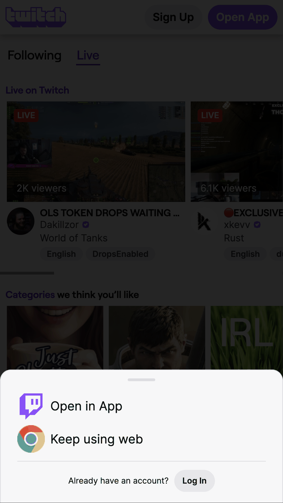
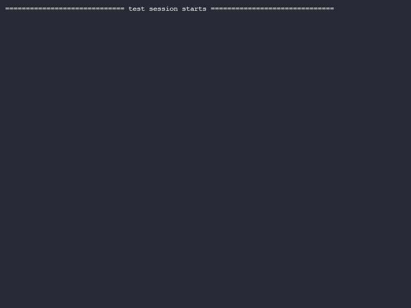

# SportyGroup Home Test - AQA Submission

This repository contains the solution for the SportyGroup AQA Home Test. It is a production-ready test automation framework built with Python, Pytest, and Selenium, covering both UI and API testing requirements.

## 🎯 Overview

The framework provides automated coverage for:
1.  **UI Testing**: A complete search and discovery flow on Twitch (Mobile View), verifying stream playback and handling dynamic overlays.
2.  **API Testing**: Validation of the Football API (`v3.football.api-sports.io`), including status codes, JSON schema integrity, and data filtering.

---

## 🏗 Architecture Design

The framework follows a modular, layered architecture designed for maintainability, readability, and DRY (Don't Repeat Yourself) standards.

### 1. UI Automation (Page Object Model)
-   **`BasePage`**: The core foundation providing abstracted Selenium interactions (`find`, `click`, `type`, `js_click`) with built-in "Self-Healing" capabilities (automatic modal dismissal on intercept).
-   **Page Objects**: (`HomePage`, `StreamerPage`) Encapsulate page-specific locators and high-level business logic.
-   **`Pages` Container**: A centralized registry for all Page Objects, automatically handled via Pytest fixtures for clean test injection.
-   **Mobile Emulation**: Configured via `driver_factory` to target specific mobile devices (default: Pixel 2), as Twitch automation is optimized for the mobile web experience.

### 2. API Automation
-   **`ApiClient`**: A robust HTTP client wrapper featuring:
    -   Centralized configuration (Base URL, Headers, Timeouts).
    -   Automatic Retries for transient failures (5xx, 429).
    -   Integrated Assertions for one-liner status code verification.
-   **Data Consistency**: Uses centralized `Endpoints` and `HttpStatus` constants to avoid hardcoded values.

### 3. Utilities & Core
-   **`wait_utils`**: Standardized wait conditions across the framework.
-   **`modal_utils`**: Intelligent handling of Twitch-specific overlays (Cookie consents, mature content gates).
-   **`scrolling_utils`**: Custom JavaScript-based scrolling for reliable content loading.

---

## 📁 Project Structure

```text
SportyGroupHomeTest/
├── api/                # API Client and Core Logic
│   ├── core/           # Config, Client, Endpoints, Status Codes
│   └── utils/          # API-specific Assertions
├── ui/                 # UI Automation Layer (POM)
│   ├── core/           # Config, Driver Factory
│   ├── pages/          # Page Objects & Container
│   └── utils/          # Modal, Wait, Scrolling, Screenshot Utils
├── tests/              # Test Suites
│   ├── api/            # API Test Cases
│   └── ui/             # UI Test Cases
├── Screenshots/        # Automated Test Evidence
├── conftest.py         # Global Pytest Fixtures
├── requirements.txt    # Project Dependencies
└── README.md           # Documentation
```

---

## 🚀 How to Run

### Prerequisites
-   Python 3.9+
-   Google Chrome
-   Internet connection (for Twitch and API access)

### 1. Setup Environment
```bash
# Clone the repository
git clone <repository_url>
cd SportyGroupHomeTest

# Install dependencies
pip install -r requirements.txt
```

### 2. Execute Tests
```bash
# Run the full suite (API + UI)
pytest

# Run UI tests only (with console output)
pytest tests/ui -v

# Run API tests only
pytest tests/api -v
```

### 3. Troubleshooting (IDE Debugging)
If you encounter `fixture 'pages' not found` while debugging in an IDE (like PyCharm):
1.  **Working Directory**: Ensure the IDE's Run/Debug Configuration has the **Working Directory** set to the project root (`SportyGroupHomeTest/`).
2.  **Pytest Config**: The framework includes a `pytest.ini` at the root which helps `pytest` discover the project structure and `conftest.py` automatically.
3.  **Packages**: We have added `__init__.py` files to the `tests/` directory tree to ensure consistent module discovery.

### 4. Configuration
Execution can be customized via environment variables:
```bash
export BROWSER=chrome
export MOBILE_DEVICE="Pixel 2"
export API_KEY="your_api_key_here"  # Optional: default key provided in Config
pytest
```

---

## 🧪 Test Cases

### 📱 UI Tests (Twitch Mobile Flow)

| Test ID | Name | Steps | Validations | Rationale |
| :--- | :--- | :--- | :--- | :--- |
| UI-01 | Twitch Search & Streamer Verification | 1. Open Twitch.tv<br>2. Search for a game (e.g., "Starcraft II")<br>3. Select the game from results<br>4. Scroll down to load more content<br>5. Select a random live streamer | 1. Verify stream is live (Video player loaded)<br>2. Capture verification screenshot | Ensures the core user journey of discovery and playback is functional on mobile web. |

### 🌐 API Tests (Football API)

| Test ID | Name | Endpoint | Validations | Rationale |
| :--- | :--- | :--- | :--- | :--- |
| API-01 | Get Leagues Status Code | `/leagues` | HTTP 200 OK | Basic availability check for the leagues endpoint. |
| API-02 | Leagues Schema Validation | `/leagues` | 1. Root contains `response`<br>2. `response` is a non-empty list<br>3. Items contain `league`, `country`, `seasons` | Ensures data integrity and contract adherence for downstream consumers. |
| API-03 | Leagues Filtering (Default) | `/leagues` | 1. Response without filters returns data<br>2. Response count >= 1 | Verifies that the endpoint returns data correctly without any query parameters. |
| API-04 | Leagues Filtering (by Name) | `/leagues` | 1. Filter by name returns expected results<br>2. Response count >= 1 | Verifies the query parameter logic and server-side filtering functionality. |

---

## 📊 Test Results

### 📱 UI Test Execution (Twitch Mobile Flow)


*Figure 1: Automated UI flow showing search, game selection, and stream verification.*

### 💻 Console Results (API + UI)


*Figure 2: Real-time terminal output with green status indicators for all passed tests.*

```text
============================= test session starts ==============================
platform darwin -- Python 3.12.0, pytest-9.0.2, pluggy-1.6.0
rootdir: /Users/isozyesil/PycharmProjects/SportyGroupHomeTest
collected 5 items

tests/api/test_get_leagues_api.py ....                                   [ 80%]
tests/ui/test_twitch_search_flow.py .                                    [100%]

============================== 5 passed in 48.77s ==============================
```

---

## 🔍 Validation Strategy

We employ a multi-layered validation strategy to ensure both functional correctness and system stability:

### 1. Visual & State Validation (UI)
- **Playback Verification**: Instead of just checking for page load, we verify the presence of the video player component to ensure the primary service (streaming) is actually working.
- **Evidence Collection**: Automated screenshots provide a visual "audit trail" for every test execution, facilitating rapid root cause analysis if a UI regression occurs.
- **Dynamic Resilience**: Tests validate that they can navigate through Twitch's dynamic environment, including intermittent overlays and lazy-loaded content.

### 2. Contract & Data Validation (API)
- **Status Assertions**: Every request is first validated for the correct HTTP status code to catch infrastructure or auth issues early.
- **Structural Integrity**: We validate the presence of mandatory keys in the JSON response. This ensures that the API contract hasn't changed in a way that would break front-end or mobile applications.
- **Functional Filtering**: By testing query parameters, we ensure the backend correctly processes business logic and returns relevant data subsets.

---

## 📈 Quality & Reliability Features

-   **Automatic Screenshots**: Every UI test execution captures a timestamped screenshot in the `Screenshots/` directory upon completion or verification.
-   **Resilience**: The framework automatically detects and dismisses intrusive modals that might intercept clicks, reducing test flakiness.
-   **Standardized Timeouts**: All waits are centralized in `Config`, allowing global tuning of framework performance.
-   **Detailed Assertions**: Custom assertion messages provide clear feedback on failure causes (e.g., missing JSON keys or incorrect status codes).
-   **Clean Test Code**: Tests are written in a declarative style, focusing on the "what" rather than the "how" of automation.
